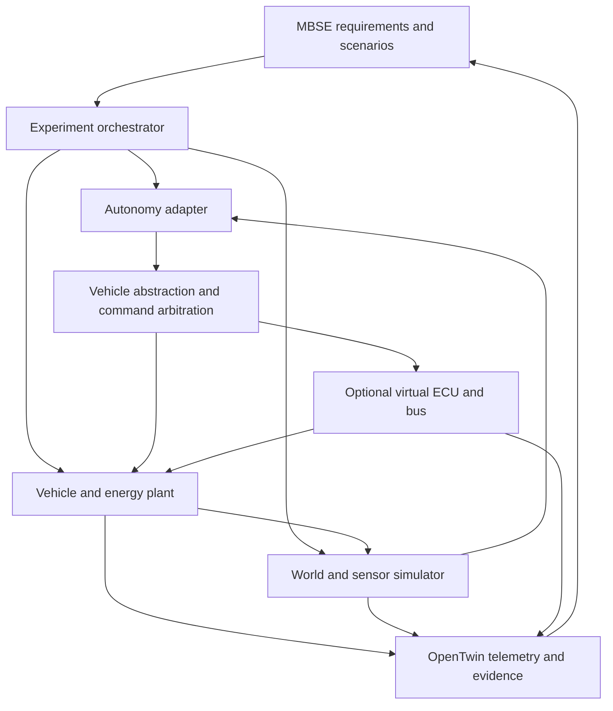
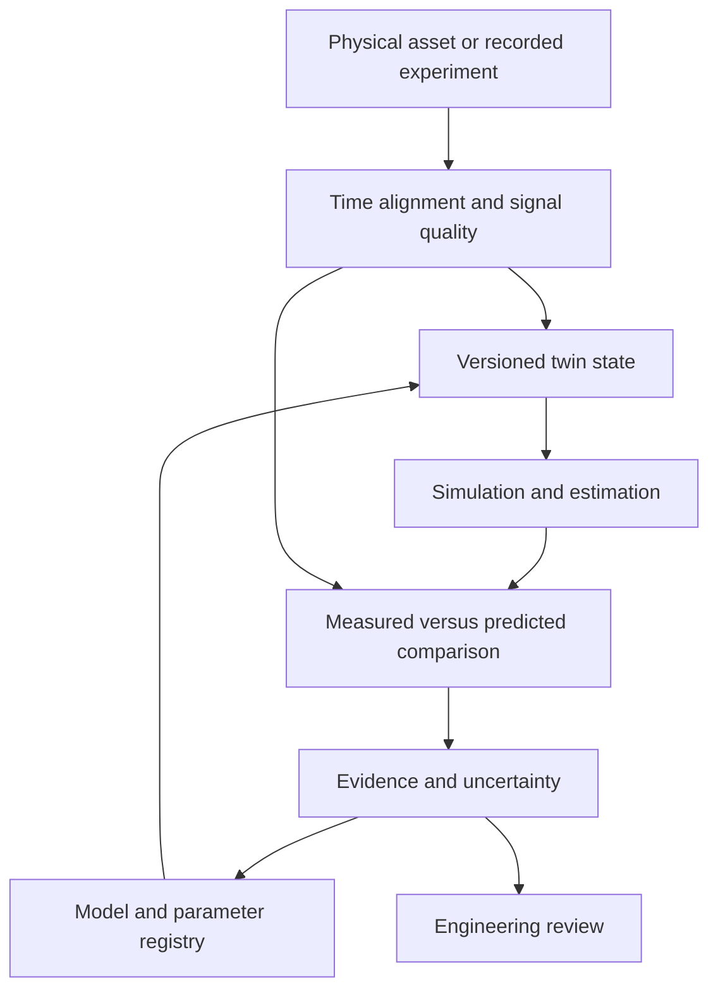

# jfxai4mass
## AI-Powered Modular Autonomous Mobility & Simulation Systems

> Open-source reference architecture for modeling, simulation, digital twins,
> artificial intelligence and modular autonomous mobility systems.

**jfxai4mass** is an open-source engineering and research compendium for the
development of **Modular Autonomous Mobility and Simulation Systems (MASS)**.

The project brings together Model-Based Systems Engineering (MBSE), Modelica,
digital twins, vehicle simulation, robotics, autonomous driving, artificial
intelligence and modular hardware/software architectures into a common
technology-neutral reference framework.

The objective is not to reproduce a specific commercial vehicle or proprietary
platform. Instead, jfxai4mass studies reusable engineering principles and open
technologies that can support simplified, interoperable and extensible mobility
platforms.

---

## Table of Contents

- [Project Vision](#project-vision)
- [Description and Context](#description-and-context)
- [Objectives](#objectives)
- [Reference Architecture](#reference-architecture)
- [Integration Contracts](#integration-contracts)
- [Execution Profiles](#execution-profiles)
- [Engineering Domains](#engineering-domains)
- [Digital Twin Architecture](#digital-twin-architecture)
- [AI and Autonomous Systems](#ai-and-autonomous-systems)
- [Modelica and Multiphysics Simulation](#modelica-and-multiphysics-simulation)
- [Open-Source Technology Compendium](#open-source-technology-compendium)
- [Vamos Integration Profile](#vamos-integration-profile)
- [Catalog Admission and Provenance](#catalog-admission-and-provenance)
- [Reference Platforms](#reference-platforms)
- [Validation and MVP Sequence](#validation-and-mvp-sequence)
- [MBSE Engineering Process](#mbse-engineering-process)
- [Modular Mobility Concept](#modular-mobility-concept)
- [OpenTwin Concept](#opentwin-concept)
- [Repository Structure](#repository-structure)
- [User Guide](#user-guide)
- [Installation Guide](#installation-guide)
- [Dependencies](#dependencies)
- [Development Roadmap](#development-roadmap)
- [How to Contribute](#how-to-contribute)
- [Code of Conduct](#code-of-conduct)
- [Authors and Maintainers](#authors-and-maintainers)
- [Intellectual Property and Reference Material](#intellectual-property-and-reference-material)
- [Disclaimer](#disclaimer)
- [License](#license)

---

# Project Vision

jfxai4mass explores a transition from vertically integrated vehicle platforms toward:

**Open Architecture + Modular Hardware + Digital Twins + Modelica + AI + Autonomous Systems**

The long-term goal is to provide reusable engineering knowledge for building
and evaluating autonomous mobility platforms without requiring dependence on
a single proprietary vehicle architecture, simulation environment, AI model,
cloud provider or hardware vendor.

The project follows five principles:

1. **Open architecture**
2. **Modularity**
3. **Interoperability**
4. **Simulation-first engineering**
5. **Technology independence**

---

# Description and Context

Modern mobility systems combine mechanical engineering, electrical and
electronic systems, embedded computing, robotics, control engineering,
artificial intelligence, communications, cloud/edge computing, simulation and
systems engineering.

jfxai4mass provides a structured compendium and reference architecture for
studying these cyber-physical systems using open-source tools and open
engineering standards.

The repository investigates technologies applicable to autonomous ground
vehicles, electric vehicles, modular utility vehicles, delivery systems,
robotic vehicles, emergency and rescue mobility, agricultural vehicles,
research vehicles, aerial mobility, UAV integration, multimodal mobility,
digital vehicle prototypes and software-defined vehicles.

---

# Objectives

## Primary Objective

Develop a reusable open engineering framework for researching, modeling,
simulating and prototyping modular autonomous mobility systems.

## Specific Objectives

- Integrate MBSE with executable simulation.
- Use Modelica for multidomain physical modeling.
- Investigate open-source autonomous-driving stacks.
- Support Software-in-the-Loop simulation.
- Support Hardware-in-the-Loop experimentation.
- Explore digital-twin architectures.
- Integrate AI-based perception and decision systems.
- Investigate modular vehicle hardware.
- Decouple applications from vehicle-specific implementations.
- Promote reproducible mobility research.

---

# Reference Architecture

The expanded MASS architecture separates scenario execution, autonomy, vehicle
physics, embedded control and digital-twin evidence. Components are replaceable.
All integration profiles and adapters described here are **proposed**, not
implemented or validated by this documentation update.



| Layer | Responsibility | Candidate references |
|---|---|---|
| Requirements | Operational domain, vehicle variant, payload and acceptance criteria | MBSE/Capella, KANO-AHP-FCE study, OSCAR |
| World and scenarios | Roads, terrain, traffic, sensors and replay | Gazebo, CARLA, AutoDRIVE, DeepDrive, SODA.Sim; CETRAN CoSim |
| Driver and autonomy | Human input, perception, planning and tracking | Vamos driving application, Autoware, RoboCar, NATURE, RTK steering |
| Physical plant | Chassis, tires, rider, powertrain, storage and thermal response | Vamos, MotorcycleDynamics, MotorcycleLib and Modelica libraries |
| Vehicle abstraction | Canonical state/commands, capabilities and command ownership | Proposed MASS adapters; OSCC and platform APIs as references |
| Embedded control | Virtual ECU, simulated buses and vehicle applications | SIL ECU Virtualization, open ECU, Eclipse Velocitas |
| Offline engineering | Aerodynamics, engine studies and structural analysis | DrivAerNet++, ICEngines, LCM and Modelica-MVEMLib |
| Digital twin | Model provenance, telemetry, calibration and evidence | Proposed OpenTwin |

**One authoritative plant per physical degree of freedom.** When Vamos owns chassis
motion, an attached world simulator renders its pose and generates sensors without
integrating a competing chassis. A Modelica energy subsystem can exchange torque,
speed and power with that chassis, provided the boundary does not double-count
drivetrain effects. Vehicle-Dynamics-Simulator remains a candidate pending source
inspection; its reviewed README does not establish capabilities.

## Integration Contracts

| Boundary | Proposed exchange | Required checks |
|---|---|---|
| Scenario to orchestrator | Scenario/map revision, initial state, environment, seed and stop rules | Repeatable reset, available assets and validity domain |
| Controller to vehicle | Timestamp, source, mode, steering, speed/torque and brake request | One active owner; units, limits, expiry and stale-command behavior |
| Plant to world/twin | Pose, velocity, acceleration, wheel states, energy and diagnostics | Named frames, SI units, sampling rate, quaternion order and signal quality |
| Modelica to co-simulation | Named ports, FMI version and model-exchange/co-simulation mode | Actual export/import test, initialization, event handling and solver ownership |
| ECU to bus | Versioned signal map, encoding and virtual CAN/Ethernet profile | Scaling, endianness, latency/loss and timestamp behavior |
| Telemetry to OpenTwin | Run ID, model revision, parameter hash, provenance and uncertainty | Distinguish measured, simulated and estimated values |

Proposed defaults are SI units, an ENU map frame and a body frame with X forward,
Y left and Z up. Each adapter must test conversions from native conventions.
Distinguish steering-wheel from road-wheel angle and wheel torque from force.

The orchestrator owns simulated or wall-clock time, communication steps and reset.
Components declare substeps, interpolation and rollback support. FMI does not
supply the master algorithm or guarantee stability. Check timestep convergence
and exchanged energy where relevant. ROS 2 carries robotics messages; FMI serves
compatible physical models; explicit simulator APIs and virtual buses serve
their respective adapters. MQTT, REST and dashboards are not assumed to provide
deterministic actuator timing. Legacy ROS 1 components require a tested bridge
or port.

## Execution Profiles

| Profile | Composition to evaluate | Acceptance evidence |
|---|---|---|
| Open driving baseline | Vamos, human/reference driver and telemetry | Reproducible maneuver and recorded model/track configuration |
| Urban autonomy | One world backend plus Autoware or RoboCar | Compatible sensor/control bridge and scenario replay |
| Off-road | NATURE, terrain world and rover plant | Terrain/contact assumptions and Ackermann/skid-steer interface checks |
| Single-track | MotorcycleDynamics or MotorcycleLib with rider/dependencies | Lean, steering, wheel contact and toolchain validation |
| EV/hybrid | Chassis owner, EHPTlib and suitable storage model | Drive-cycle tracking, energy balance and coupling convergence |
| ECU SIL | Selected plant and SIL ECU Virtualization | Reset, bus timing, fault cases and compatible FMI versions |
| Utility/rescue | Abstract truck/pod and configurable payload | Mass/inertia, braking, energy and mission requirement comparisons |

These are alternatives, not a requirement to install every project. Begin a
free-software profile with Vamos and/or Gazebo and evaluated OpenModelica models.
Keep proprietary-engine integrations and restricted datasets optional.

---

# Engineering Domains

| Domain | Purpose |
|---|---|
| Mechanical | Chassis, suspension, structures and vehicle dynamics |
| Electrical | Power distribution, motors and electronic systems |
| Energy | Battery, hybrid and alternative energy architectures |
| Control | Vehicle control and feedback systems |
| Sensors | Camera, LiDAR, radar, GNSS, IMU and IoT |
| Compute | Edge computing and vehicle computers |
| Communications | Vehicle networks, V2X and telemetry |
| AI | Perception, prediction and intelligent decision support |
| Simulation | Virtual validation and scenario execution |
| Digital Twin | Synchronization between physical and virtual systems |
| Payload | Mission-specific interchangeable modules |

---

# Digital Twin Architecture

OpenTwin is the proposed connection between a versioned model, an identified
physical asset when available, and telemetry or simulation evidence. A rendered
vehicle or static CAD model alone is not a synchronized digital twin.



Preserve vehicle/payload configuration, calibration, source revisions, solver
settings, scenario seed, adapter versions, logs and requirement IDs for each run.
Keep predictions separate from observations and record invalid signals. Parameter
updates need provenance and a new revision. Start with offline replay and read-only
telemetry before any real actuator integration.

Proposed metrics include tracking error, yaw/roll response, stopping behavior,
wheel slip, energy per distance, battery state, latency and model residuals.
Set tolerances from the experiment and reference data before execution. This
README does not claim measured performance or completed co-simulation.

---

# AI and Autonomous Systems

Potential AI capabilities include perception (object detection, semantic
segmentation, lane/terrain detection and sensor fusion), prediction
(trajectory, energy and predictive maintenance), planning (route, motion,
mission and fleet optimization), and digital-twin intelligence (anomaly
detection, surrogate modeling, simulation acceleration and parameter
estimation).

AI should remain a modular subsystem rather than a mandatory dependency of the
physical architecture.

---

# Modelica and Multiphysics Simulation

Modelica provides a foundation for multidomain physical modeling.

```text
Vehicle
├── Mechanical
│   ├── Chassis
│   ├── Suspension
│   └── Vehicle Dynamics
├── Electrical
│   ├── Motors
│   ├── Power Electronics
│   └── Distribution
├── Energy
│   ├── Battery
│   ├── Hybrid Systems
│   └── Energy Management
├── Thermal
│   ├── Battery Cooling
│   ├── Electronics
│   └── HVAC
└── Control
    ├── Steering
    ├── Braking
    └── Powertrain Control
```

---

# Open-Source Technology Compendium

This catalog distinguishes software, models, datasets, hardware, standards and
research methods. Entries are research references or optional integration
candidates, not mandatory dependencies. Public source availability does not make
every entry free software. Source documentation was reviewed during this expansion;
no builds, simulations or hardware validations are claimed. Pin revisions and
review the selected code, asset and data licenses before adoption.

## 1. Vehicle Dynamics and Interactive Driving

| Reference | Scope and proposed integration | Qualification notes |
|---|---|---|
| [Vehicle-Dynamics-Simulator](https://github.com/robotics-intelligent-systems/Vehicle-Dynamics-Simulator) | Candidate vehicle-dynamics backend | Reviewed README contains only the title. API, runtime, fidelity and licensing remain unverified. |
| [Vamos](https://github.com/robotics-intelligent-systems/vamos), [project description](https://vamos.sourceforge.net/) | C++ automotive simulation framework including a real-time, first-person 3D driving application | Organization repository contains a GPL license; custom telemetry/control adapter proposed, not an existing native ROS 2/FMI integration. |
| [MotorcycleDynamics](https://github.com/robotics-intelligent-systems/MotorcycleDynamics) | Modelica motorcycle chassis, road and wheel-road interaction; active-control research | README identifies v0.7 from 2011 and Modelica License 2. Validate legacy toolchain and dependencies. |
| [MotorcycleLib](https://github.com/sdk2035/MotorcycleLib) | Bicycle/motorcycle models and virtual rider for lean/preview-path tracking | README identifies v1.0 from 2009 and Modelica License 2; requires BondLib, MultiBondLib and WheelsAndTires. |

### Vamos Integration Profile

Vamos separates vehicle physics from its interactive driving application.
Documentation covers drivetrain, tires, suspension and aerodynamic effects;
the organization repository describes XML vehicle configuration, tracks,
computer-controlled cars and a Meson-based C++ build. Requirements vary by
revision, so use the selected source rather than mixing historical instructions.

1. Establish a standalone car/track baseline with a pinned revision.
2. Inspect source hooks and define a versioned command/state adapter; do not
   assume a native ROS 2, FMI or stable external plugin API.
3. Let Vamos own chassis dynamics; disable duplicate motion integration in any
   attached sensor/world simulator.
4. Record controls and available speed, pose and wheel/chassis signals with one
   simulation clock. Document missing signals.
5. Compare acceleration, braking and cornering across repeat runs and timesteps.
6. Couple a Modelica energy subsystem only after defining torque/speed or power
   exchanges and excluding duplicated drivetrain effects.

Use the first-person application for human-driver experiments and a future adapter
for controller-in-the-loop studies. Interactive graphics do not establish sensor
fidelity or hard-real-time HIL capability. Check GPL and track/model asset rights.

## 2. World Simulation and Co-Simulation

| Reference | Scope and proposed integration | Qualification notes |
|---|---|---|
| [Gazebo](https://gazebosim.org/) and [Grizzly RUV simulator](https://github.com/g/grizzly_simulator) | Robotics worlds and a vehicle-specific terrain simulation reference | Grizzly points to historical ROS usage; verify Gazebo generation and ROS compatibility. |
| [CARLA](https://github.com/carla-simulator/carla) | Driving scenes, sensors and scenario execution | Pin simulator/client/assets and account for engine dependencies. |
| [SODA.Sim](https://github.com/soda-auto/soda-sim) | Component, sensor and ECU simulation reference | Uses Unreal Engine and a custom [EULA](https://github.com/soda-auto/soda-sim/blob/master/LICENSE.md); optional source-visible reference, not the free-software baseline. Roadmap items are not implemented capability evidence. |
| [AutoDRIVE](https://github.com/Tinker-Twins/AutoDRIVE) | Integrated Simulator, Testbed and Devkit for autonomy and sim-to-real research | Evaluate each component's API, license, assets and engine requirements. |
| [DeepDrive](https://github.com/deepdrive/deepdrive) | Driving AI simulation and agent interfaces | Historical Python/TensorFlow environment requires reproducibility work. |
| [CARLA GymDrive](https://github.com/angelomorgado/CARLA-GymDrive) | Gymnasium-like driving episodes for reinforcement learning | Requires CARLA; pin observations/actions, rewards, reset and termination. Not a replacement dynamics engine. |
| [CETRAN CoSim](https://github.com/cetran-sg/CoSim) | CARLA-based virtual AV testing with an Apollo 8.0 reference bridge | MIT according to README. Its documented bridge is not a generic existing Modelica/FMI master. |

## 3. Autonomy, Navigation and Control

| Reference | Scope and proposed integration | Qualification notes |
|---|---|---|
| [NATURE](https://github.com/sdk2035/nature-stack), [upstream](https://github.com/CGoodin/nature-stack) | Navigating All Terrains Using Robotic Exploration: off-road perception, planning and control | Ackermann/skid-steer options; README includes ROS 1/2 paths that require version-specific testing. |
| [Autoware](https://github.com/autowarefoundation/autoware) | Autonomous-driving stack for perception, planning and control | Define operational domain and compatible vehicle/simulator adapters. |
| [RoboCar](https://github.com/sntubix/robocar) | Modular ROS 2 driving software | Component configuration and GPU requirements depend on the chosen profile. |
| [openpilot](https://github.com/commaai/openpilot) | Robotics operating-system and supported-vehicle driver-assistance reference | Study replay and interfaces; do not equate assistance with unrestricted autonomy. |
| RTK Autosteer — [Simplesteer](https://github.com/jm2unbound/simplesteer) | Concrete candidate for GNSS guidance, AB lines and steering | Candidate matching the requested category, not a unique identity claim. Simulate GNSS degradation and actuator response. |
| [Open Source Car Control (OSCC)](https://github.com/PolySync/oscc) | Hardware/software vehicle actuation interfaces | Vehicle-specific reference; first evaluate against mock or simulated interfaces. |

## 4. Experimental Platforms and Modular Vehicles

| Reference | Scope and proposed integration | Qualification notes |
|---|---|---|
| [AutoRally](https://github.com/AutoRally/autorally) | High-performance autonomous vehicle research testbed | Dynamics/control benchmark; qualify its legacy ROS environment. |
| [VESC Self-Driving Model Vehicle Platform](https://github.com/vedderb/rise_sdvp) | Model-vehicle hardware/software with RTK-GNSS path following | Supports Ackermann/differential platforms; distinct from motor-controller firmware alone. |
| [JPL Open Source Rover](https://github.com/nasa-jpl/open-source-rover) | COTS six-wheel rover for education and terrain research | Wheel/suspension and utility-payload reference. |
| [AV4EV](https://github.com/mlab-upenn/gokart-mechatronics), [simulation](https://github.com/mlab-upenn/AV4EV_Sim) | Modular autonomous electric go-kart and associated simulation | Separate hardware revisions from simulator dependencies and calibration. |
| [OpenPodcar](https://github.com/OpenPodcar/OpenPodcar) | Hardware/software pod with ROS control and Gazebo simulation | Low-speed mobility and human-robot interaction reference; validate inherited versions. |
| [Open Kei Truck](https://github.com/torresorona/open-kei-truck), [portfolio copy](https://github.com/sdk2035/open-kei-truck) | Early-stage utility EV requirements and component/battery sourcing | Not a validated vehicle or simulator. Requested association with Mutiny Open Source Truck Project remains unverified in the reviewed README. |

## 5. Modelica Interfaces, Motors and Energy

| Reference | Scope and proposed integration | Qualification notes |
|---|---|---|
| [VehicleInterfaces](https://github.com/modelica/VehicleInterfaces) | Modelica Association interface definitions and automotive subsystem architecture | BSD-3-Clause per README; interface foundation, not a complete validated plant. |
| [OpenIMDML](https://github.com/ALSETLab/OpenIMDML) | Open Instance Multi-Domain Motor Library: induction motors and drive representation in the phasor domain | Use only where phasor assumptions and timescales fit; not automatically a detailed traction inverter. |
| [OpenIPSL](https://github.com/OpenIPSL/OpenIPSL) | Open-Instance Power System Library for power-system dynamics | Charging/grid interaction candidate, not chassis dynamics or cell electrochemistry. |
| [EHPTlib](https://github.com/robotics-intelligent-systems/EHPTlib), [upstream](https://github.com/ceraolo/EHPTlib) | Electric & Hybrid Power Train library; matches the requested free powertrain library | Successor to SMEHV according to README; pin examples, Modelica version and compiler. |
| [ElectricalEnergyStorage](https://github.com/modelica-3rdparty/ElectricalEnergyStorage) | Storage models of differing complexity, cells/stacks, loads and charging | Modelica License 2 per README; no longer maintained. Fundamental parts moved to Modelica Standard Library 4.0.0; evaluate that alternative. |

OpenModelica is a candidate runtime, not proof that legacy libraries compile
unchanged. Record dependencies, MSL version, solver, initialization, example
outputs and FMU export/import results separately.

## 6. ECUs, Vehicle Applications and Design Toolchains

| Reference | Scope and proposed integration | Qualification notes |
|---|---|---|
| Open ECU — [Open Source Electronic Control Module](https://github.com/marcocrio/opens-ecu) | Educational fuel-management ECU; concrete candidate for the generic requested name | Intended project identity remains unconfirmed. Not a general vehicle ECU platform or a claim about similarly named commercial products. |
| [SIL ECU Virtualization](https://github.com/sdk2035/sil-ecu-virtualization) | Software-component/RTE progression, virtual CAN/Ethernet, plant FMU and co-simulation master | Windows-oriented toolchain and specific FMI/bus versions, including prerelease elements. Reported upstream results are not reproduced MASS results. |
| [Eclipse Velocitas](https://github.com/eclipse-velocitas/vehicle-app-python-template) | Containerized Vehicle App toolchain and SDK pattern | Optional vehicle service layer, not a physics simulator or deterministic control guarantee. |
| [OSCAR IDE / Eclipse AVSys](https://github.com/rubis-lab/oscar-ide) | Model-based hardware/software architecture and ROS skeleton generation | Historical Java/Eclipse environment; qualify generated code and ROS 2 migration. |
| [Vector SIL Kit](https://github.com/vectorgrp/sil-kit) | Supporting distributed SIL and virtual-bus component | Included as ECU integration support; versions and synchronization require tests. |

## 7. Aerodynamics, Structural Mechanics and Engines

| Reference | Scope and proposed integration | Qualification notes |
|---|---|---|
| [DrivAerNet++](https://github.com/Mohamedelrefaie/DrivAerNet) | Geometry/CFD dataset for aerodynamic and surrogate-model studies | Dataset, not driving simulator. Fastback/notchback/estateback families do not establish every vehicle-class coverage. README advertises CC BY-NC 4.0; separate from unrestricted commercial datasets. |
| [LCM](https://github.com/sdk2035/LCM), [upstream](https://github.com/sandialabs/LCM) | Laboratory for Computational Mechanics: finite-element solids and thermo-mechanics | Offline structural analysis/reduced-model input. Not the unrelated LCM messaging library. |
| [ICEngines](https://github.com/OpenFOAM/ICengines) | OpenFOAM engine-simulation libraries; current reviewed README describes AATE | Offline CFD and engine studies; pin OpenFOAM compatibility. Use calibrated reduced models for interactive driving. |
| [Modelica-MVEMLib](https://github.com/modelica-3rdparty/Modelica-MVEM) | Mean Value Engine modeling framework from openProd | GPL per README; historical Dymola requirement documented. OpenModelica compatibility remains an evaluation task. |

Preserve source conditions, training data and validity ranges for aerodynamic,
thermal or structural surrogates. Flag extrapolation. Offline CFD/FEA fidelity
does not imply execution at interactive rates.

## 8. Standards and Requirements Research

| Reference | Scope and proposed integration | Qualification notes |
|---|---|---|
| [CMOSS](https://www.army.mil/article/285078/cmoss_mounted_form_factor_becomes_new_army_program) | Embedded equipment modularity and open-systems architecture reference | Not an open-source simulator; use interface/replacement principles without claiming conformance. |
| [SOSA](https://www.opengroup.org/sosa) | Sensor Open Systems Architecture standards ecosystem | Standards/profile reference, not a software license or interoperability guarantee. |
| [Modular Ambulance Design Based on KANO-AHP-FCE Model](https://www.designartj.com/EN/10.19554/j.cnki.1001-3563.2025.16.052) | Research method for requirements prioritization and design evaluation | Not executable software or a certified ambulance. Evaluate data/artifact rights separately. |

## 9. Supporting Engineering Tools

| Layer | Candidate technologies |
|---|---|
| MBSE | Capella / Arcadia |
| Physical models | Modelica / OpenModelica |
| Robotics | ROS 2 and explicit adapters |
| AI and vision | Python ecosystem / OpenCV |
| Execution | Docker; Kubernetes only where distributed workloads justify it |
| Observability | Grafana and an evaluated time-series store such as InfluxDB |
| Vehicle services | Eclipse Velocitas |

## Catalog Admission and Provenance

Record canonical repository, portfolio fork, commit/tag, licenses for code and
assets/data, dependencies, platform/compiler, model assumptions, interfaces,
adapter owner, reproducible command, expected output and known limitations.
Preserve upstream attribution and record fork divergence.

Use states **cataloged**, **identity pending**, **build verified**, **adapter
verified**, **scenario validated** and **hardware evaluated**. Integrations in
this expansion remain cataloged/proposed; Open ECU identity and the Mutiny
association remain pending. Neither a clone nor a diagram is validation evidence.

---

# Reference Platforms

The categorized compendium is the canonical inventory. Execution profiles map it
to experiments with one platform, one controller owner and one dynamics owner.

## Validation and MVP Sequence

| Stage | Deliverable | Acceptance evidence |
|---|---|---|
| Inventory | Pinned source/license/dependency matrix | Exact identity and restrictions recorded |
| Baseline | Vamos car/track and separate legacy Modelica examples | Clean build, repeatable run and reference outputs |
| Adapter | Commands, state, units, frames and timestamps | Conversion, reset and stale-message checks |
| Co-simulation | Energy subsystem or world/autonomy adapter | Clock ownership, timestep comparison and coupling residuals |
| ECU SIL | Virtual controller and plant loop | Compatible bus/FMI versions, replay and injected fault cases |
| Twin calibration | Measured versus predicted comparison | Independent holdout runs, error bounds and parameter provenance |

Candidate scenarios include acceleration/braking, constant-radius cornering,
lane changes, motorcycle lean/path tracking, terrain traversal, drive-cycle energy
use, payload changes and simulated sensor/bus faults. Define metrics and tolerances
before running each scenario and respect each model's validity domain.

Start with Vamos and source inspection of the three linked dynamics repositories,
then implement one adapter and offline telemetry. Add either energy coupling or
an autonomy/world bridge before ECU SIL. Introduce physical measurements only when
a suitable dataset or instrumented platform exists. MIL, SIL, HIL and road testing
are different evidence levels; this documentation update implements none of them.

---

# MBSE Engineering Process

The existing `MBSE` area can evolve into the following lifecycle:

```text
Requirements
     │
     ▼
Operational Analysis
     │
     ▼
System Architecture
     │
     ▼
Logical Architecture
     │
     ▼
Physical Architecture
     │
     ├───────────┬───────────┐
     ▼           ▼           ▼
    CAD         CAM         CAS
     │           │           │
     └───────────┴─────┬─────┘
                       ▼
                 Digital Twin
                       │
                       ▼
                 AI Optimization
```

Arcadia and Capella can provide the systems-engineering methodology and
architecture-modeling environment. CAD supports simplified reusable
vehicle/component geometry, CAM manufacturing-oriented prototype analysis,
and CAS end-to-end, vehicle, multiphysics, autonomy, control, energy and
performance simulation.

---

# Modular Mobility Concept

```text
COMMON PLATFORM
│
├── Drive-by-wire
├── Energy
├── Compute
├── Communications
├── Safety
├── Sensors
└── Vehicle API
        │
        ▼
INTERCHANGEABLE MODULES
│
├── Cargo
├── Passenger
├── Research
├── Rescue
├── Agricultural
├── Logistics
├── Sensor Platform
└── UAV / Robotic Payload
```

---

# OpenTwin Concept

`OpenTwin` is the conceptual digital-twin layer proposed for this repository.
It is not intended to represent a proprietary commercial digital-twin product.

```text
Physical Vehicle
      +
Open Sensors
      +
Edge Computing
      +
Modelica Simulation
      +
AI
      +
Open Data Interfaces
      =
Open Digital Twin
```

The implementation should prioritize standard interfaces and replaceable
components.

---

# Repository Structure

The following is a **proposed target layout**, not an inventory of implemented
modules. The inspected root contains README.md and MBSE/; additional paths and
policy/license files must be introduced with their respective modules.

```text
jfxai4mass/
├── README.md
├── LICENSE
├── CONTRIBUTING.md
├── CODE_OF_CONDUCT.md
├── MBSE/
│   ├── requirements/
│   ├── operational-analysis/
│   ├── logical-architecture/
│   └── physical-architecture/
├── CAD/
│   ├── vehicle/
│   ├── modules/
│   └── payloads/
├── CAM/
│   ├── prototypes/
│   └── manufacturing/
├── CAS/
│   ├── modelica/
│   ├── robotics/
│   ├── vehicle/
│   └── cosimulation/
├── digital-twin/
├── autonomy/
├── ai/
├── interfaces/
├── simulation/
└── docs/
```

---

# User Guide

A typical workflow is:

1. Define the mobility use case.
2. Capture requirements using MBSE.
3. Create the logical system architecture.
4. Select sufficiently abstract hardware modules.
5. Create physical models using Modelica.
6. Select an appropriate robotics or vehicle simulator.
7. Define open interfaces.
8. Execute virtual scenarios.
9. Connect AI components where required.
10. Analyze results and iterate.

---

# Installation Guide

There is no mandatory monolithic installation.

```bash
git clone https://github.com/robotics-intelligent-systems/jfxai4mass.git
cd jfxai4mass
```

Example conceptual environment:

```text
MBSE             -> Capella
Physical Models  -> OpenModelica
Robotics         -> ROS 2
Simulation       -> Gazebo
AI               -> Python
Containers       -> Docker
```

Exact procedures should be maintained inside each module.

---

# Dependencies

The project distinguishes:

- **Required Dependencies** — software strictly required by a module.
- **Optional Integrations** — tools extending functionality.
- **Research References** — projects used for comparison or evaluation.

This prevents the compendium from incorrectly suggesting that every referenced
project forms part of one software distribution.

---

# Development Roadmap

## Phase 1 — Compendium Refactoring
- [x] Identify open mobility technologies.
- [x] Organize MBSE/CAD/CAM/CAS concepts.
- [x] Establish intellectual-property disclaimer.
- [x] Categorize the requested references and Vamos integration profile.
- [ ] Complete revision-pinned license/dependency manifests.
- [ ] Record licenses for external projects.
- [x] Distinguish software, data, hardware, standards and research references.
- [ ] Qualify a free-software-only executable profile.

## Phase 2 — Reference Architecture
- [x] Document proposed MASS integration layers and execution profiles.
- [ ] Implement and validate adapters.
- [ ] Define OpenTwin architecture.
- [ ] Define vehicle abstraction layer.
- [ ] Define modular payload interface.
- [x] Document proposed interface contracts and clock ownership.
- [ ] Implement schemas and executable interface checks.

## Phase 3 — Simulation MVP
- [ ] Establish a reproducible Vamos baseline.
- [ ] Inspect Vehicle-Dynamics-Simulator capabilities and licensing.
- [ ] Compile MotorcycleDynamics and MotorcycleLib with pinned dependencies.
- [ ] Create simplified vehicle model.
- [ ] Implement Modelica physical subsystem.
- [ ] Connect ROS 2.
- [ ] Integrate an open simulator.
- [ ] Implement telemetry pipeline.
- [ ] Create digital-twin dashboard.

## Phase 4 — AI Integration
- [ ] Perception experiments.
- [ ] Predictive maintenance.
- [ ] Energy optimization.
- [ ] Simulation surrogate models.
- [ ] Autonomous planning experiments.

## Phase 5 — Modular Mobility
- [ ] Ground mobility module.
- [ ] Cargo module.
- [ ] Rescue module.
- [ ] UAV integration.
- [ ] Multimodal simulation scenarios.

---

# How to Contribute

Contributions are welcome in Modelica, autonomous systems, robotics, MBSE,
digital twins, open vehicle interfaces, AI, simulation, documentation, open
hardware and interoperability testing.

```bash
git checkout -b feature/my-contribution
git add .
git commit -m "Add: description of contribution"
git push origin feature/my-contribution
```

Pull requests should describe the problem, solution, dependencies, licenses and
validation/simulation results. Do not submit proprietary models, confidential
information or assets without redistribution rights.

---

# Code of Conduct

Contributors are expected to maintain a professional, inclusive and
collaborative environment. A dedicated `CODE_OF_CONDUCT.md` should be
maintained at repository root.

---

# Authors and Maintainers

Maintained by the **Robotics Intelligent Systems** open-source initiative.

Project repository: `robotics-intelligent-systems/jfxai4mass`

Original authorship of third-party projects remains with their respective
developers and organizations.

---

# Intellectual Property and Reference Material

This repository is intended to develop **original, sufficiently simplified and
abstract engineering models**.

Photographs, renders, vehicle concepts, diagrams or multimedia resources used
during early research phases may serve exclusively as conceptual references.
Their inclusion must not be interpreted as ownership of a referenced design,
authorization to manufacture it, transfer of intellectual-property rights or
endorsement by its original designer/manufacturer.

Where a reference asset cannot legally be redistributed, it should be replaced
by an original abstract representation before publication or distribution.

---

# Disclaimer

jfxai4mass is a research, educational and experimental project. It is **not a
certified automotive, aviation, medical, emergency-response or safety-critical
system**.

Simulation results are not sufficient evidence for operating a real autonomous
vehicle. Real-world deployment requires independent engineering validation,
verification, safety analysis and compliance with applicable regulations and
standards.

The project uses the BID repository template only as a documentation-structure
reference. This repository does not claim BID funding, endorsement, catalog
membership or institutional affiliation.

---

# License

The applicable project license should be maintained in the repository root:

```text
LICENSE
```

Third-party projects, libraries, models and datasets retain their respective
licenses. Before incorporating external components into a distributable build,
verify software-license compatibility, model/data licensing, attribution,
trademark restrictions, patent considerations and redistribution permissions.

---

# Open Engineering Principles

**Open Standards · Open Interfaces · Open Models · Modular Architecture ·
Reproducible Simulation · Interoperability · Sustainable Engineering**

> Build models before machines.  
> Simulate before deployment.  
> Design interfaces before dependencies.  
> Keep the architecture replaceable.
